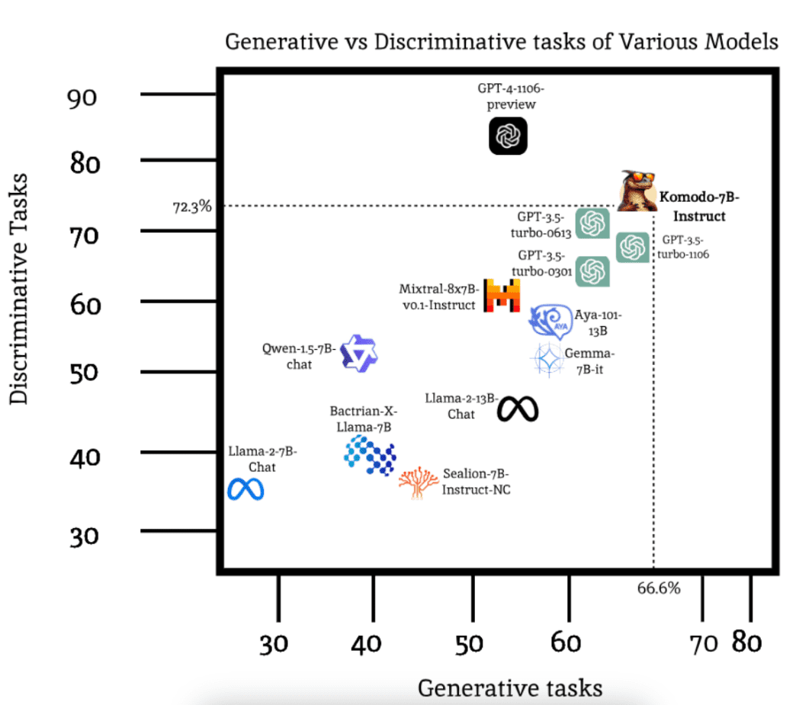

# Yellow-AI-NPL / komodo-7b-base

Original source : 
<pre>https://huggingface.co/Yellow-AI-NLP/komodo-7b-base</pre>

---

&nbsp;

## Model Card for Komodo-7B-Base

Komodo-7B-Base adalah large language model yang dikembangkan melalui pelatihan awal dan perluasan kosakata di atas Llama-2-7B-Base. Model ini dapat menangani bahasa Indonesia, bahasa Inggris, dan 11 bahasa daerah di Indonesia.

**Disclaimer**: Ini bukan model instruction-tuned , fine-tuning diperlukan untuk tugas downstream. Sebagai contoh, orang biasanya menggunakan dataset Alpaca untuk penyempurnaan lebih lanjut di atas model Llama-2-7B-Base. Oleh karena itu, tidak ada template yang cepat untuk model ini.

&nbsp;

**Model Details**

<div align="center">
    
</div> 

&nbsp;

**Model Description**

Rincian lebih lanjut dapat ditemukan dalam makalah kami https://arxiv.org/abs/2403.09362
- **Developed by**: Yellow.ai
- **Model type**: Decoder
- **Languages**: English, Indonesian, Acehnese, Balinese, Banjarese, Buginese, Madurese, Minangkabau, Javanese, Dayak Ngaju, Sundanese, Toba Batak, Lampungnese
- **License**: llama2

&nbsp;

**Usage Example**

Karena ini adalah model yang terjaga keamanannya, Anda harus masuk ke akun HF Anda sebelum menggunakan model ini. Di bawah ini adalah salah satu cara untuk melakukannya. Anda bisa mendapatkan Token HF dari profil Anda (Profile -> Settings -> Access Tokens)

```bash
    import huggingface_hub
    huggingface_hub.login("YOUR_HF_TOKEN")
```

Setelah Anda masuk, Anda dapat mulai mengunduh dan memuat model & tokenizer. Kami menulis fungsi decoding khusus untuk Komodo-7B, oleh karena itu kami perlu memberikan trust_remote_code = True. Kode juga dapat bekerja tanpa parameter ini, tetapi proses decoding tidak akan bekerja seperti yang diharapkan.

```bash
    import torch
    from transformers import AutoTokenizer, AutoModelForCausalLM

    device = "cuda:0" if torch.cuda.is_available() else "cpu"

    tokenizer = AutoTokenizer.from_pretrained("Yellow-AI-NLP/komodo-7b-base",trust_remote_code=True)
    model = AutoModelForCausalLM.from_pretrained("Yellow-AI-NLP/komodo-7b-base",trust_remote_code=True)
    model = model.to(device)
```
Kemudian, Anda bisa mencoba menggunakan model ini.
```bash
    full_prompt = "Candi borobudur adalah"

    tokens = tokenizer(full_prompt, return_tensors="pt").to(device)
    output = model.generate(tokens["input_ids"], eos_token_id=tokenizer.eos_token_id)

    print(tokenizer.decode(output[0], skip_special_tokens=True))
    # Candi borobudur adalah candi yang terletak di Magelang, Jawa Tengah.
```

&nbsp;

### Technical Specifications
**Model Architecture and Objective**<br />

Komodo-7B adalah model dekoder yang menggunakan arsitektur Llama-2.

 **Parameter**   | **Komodo\-7B** 
-----------------|----------------
 Layers          | 32             
 d\_model        | 4096           
 head\_dim       | 32             
 Vocabulary      | 35008          
 Sequence Length | 4096      

&nbsp;

**Tokenizer Details**

Menyadari pentingnya keragaman bahasa, kami berfokus untuk meningkatkan kemampuan model bahasa kami dalam bahasa Indonesia dan bahasa daerah. Untuk mencapai hal ini, kami secara sistematis memperluas kosakata tokenizer dengan mengidentifikasi dan memasukkan sekitar 2.000 kata yang sering digunakan khusus untuk bahasa Indonesia dan 1.000 kata untuk bahasa daerah yang tidak ada dalam model Llama-2.

Metode standar untuk meningkatkan kosakata biasanya melibatkan pengembangan tokenizer baru dan mengintegrasikannya dengan yang sudah ada. Teknik ini telah menunjukkan hasil yang mengesankan dalam proyek-proyek seperti Chinese-LLaMA dan Open-Hathi. Keefektifan strategi ini dapat dikaitkan dengan perbedaan linguistik yang signifikan antara bahasa-bahasa seperti bahasa Mandarin dan Hindi jika dibandingkan dengan bahasa Inggris. Sebaliknya, bahasa Indonesia menggunakan aksara Latin yang sama dengan bahasa Inggris, yang menghadirkan tantangan yang berbeda.

Kami menguji metode tradisional, serta pendekatan baru di mana kami memasukkan n kata teratas (bukan token) dari kosakata bahasa Indonesia. Kami menemukan bahwa dengan pendekatan baru, kami dapat mencapai skor kesuburan yang lebih baik dengan menambahkan sekitar 3000 kosakata baru. Menambahkan lebih dari 3000 kata tidak secara signifikan meningkatkan skor kesuburan lebih lanjut, tetapi meningkatkan ukuran matriks embedding, yang mengarah ke waktu pelatihan yang lebih lama.

&nbsp;

**Training Data | Training Procedure | Preprocessing**<br />
Rincian lebih lanjut dapat ditemukan di makalah kami: https://arxiv.org/abs/2403.09362

&nbsp;

**Evaluation & Results**

Harap diperhatikan bahwa nilai pembandingan di bawah ini didasarkan pada Model SFT kami, Komodo-7B-Instruct, sementara di sini kami hanya merilis model dasar, Komodo-7B-base.

&nbsp;

 **Organization** | **Model Name**             | **Indo MMLU** | **ID-EN** | **XCOPA-ID** | **Intent Classification** | **Colloquial Detection** | **NusaX-Senti** | **ID-Hate Speech** | **TydiQA-ID** | **Indosum** | **Average** 
------------------|----------------------------|---------------|-----------|--------------|---------------------------|--------------------------|-----------------|--------------------|---------------|-------------|-------------
 OpenAI           | GPT-3.5-turbo-0301         | 51.3          | 64.5      | 70.0         | 82.0                      | 64.1                     | 47.2            | 68.0               | 85.3          | 41.0        | 63.7        
 OpenAI           | GPT-3.5-turbo-0613         | 52.7          | 66.8      | 88.2         | 84.0                      | 75.1                     | 63.3            | 63.7               | 86.4          | 40.0        | 68.9        
 OpenAI           | GPT-3.5-turbo-1106         | 53.3          | 69.7      | 89.3         | 84.0                      | 64.2                     | 59.8            | 56.6               | 88.0          | 42.0        | 67.4        
 OpenAI           | GPT-4-preview-1106         | 69.8          | 78.0      | 98.3         | 89.0                      | 92.7                     | 66.1            | 73.4               | 72.0          | 33.0        | 74.7        
 Meta             | Llama-2-7B-Chat            | 30.4          | 45.6      | 41.5         | 57.0                      | 31.4                     | 2.9             | 41.3               | 11.7          | 34.0        | 32.9        
 Meta             | Llama-2-13B-Chat           | 32.0          | 61.7      | 38.0         | 59.0                      | 31.1                     | 58.7            | 57.2               | 71.9          | 40.0        | 50.0        
 Google           | Gemma-7B-it                | 37.4          | 73.6      | 57.7         | 77.1                      | 18.8                     | 44.2            | 54.8               | 73.3          | 44.0        | 53.4        
 Mistral          | Mixtral-8x7B-v0.1-Instruct | 45.2          | 57.8      | 88.7         | 86.0                      | 41.1                     | 52.8            | 68.8               | 90.3          | 14.0        | 60.5        
 AISingapore      | Sealion-7B-Instruct-NC     | 23.9          | 26.9      | 41.3         | 37.0                      | 41.8                     | 30.7            | 57.3               | 65.3          | 26.0        | 38.9        
 Cohere           | Aya-101-13B                | 47.7          | 47.3      | 84.0         | 64.0                      | 18.9                     | 74.6            | 72.7               | 81.3          | 39.0        | 58.8        
 MBZUAI           | Bactrian-X-Llama-7B        | 23.6          | 43.2      | 45.3         | 42.0                      | 50.3                     | 44.5            | 42.4               | 65.0          | 15.0        | 41.3        
 Alibaba          | Qwen-1.5-7B-chat           | 40.0          | 56.0      | 29.5         | 85.0                      | 41.8                     | 58.7            | 63.9               | 51.22         | 29.0        | 50.6        
 Yellow.ai        | Komodo-7B-Instruct         | 43.2          | 90.5      | 79.6         | 84.0                      | 73.6                     | 79.3            | 56.2               | 90.3          | 43.0        | 71.1        

&nbsp;

<div align="center">
    
</div> 

&nbsp;

**Infrastructure**

 **Training Details** | **Komodo-7B** 
----------------------|---------------
 AWS EC2 p4d.24xlarge | 1 instances   
 Nvidia A100 40GB GPU | 8             
 Training Duration    | 300 hours     

&nbsp;

**Citation**

```bash
    @misc{owen2024komodo,
        title={Komodo: A Linguistic Expedition into Indonesia's Regional Languages}, 
        author={Louis Owen and Vishesh Tripathi and Abhay Kumar and Biddwan Ahmed},
        year={2024},
        eprint={2403.09362},
        archivePrefix={arXiv},
        primaryClass={cs.CL}
    }
```