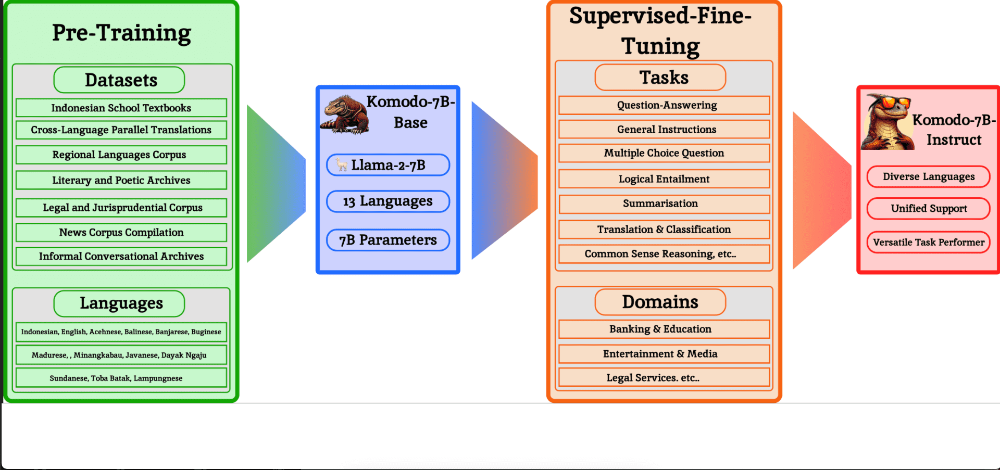

# Yellow-AI-NPL / komodo-7b-base

Original source : 
<pre>https://huggingface.co/Yellow-AI-NLP/komodo-7b-base</pre>

---

&nbsp;

## Model Card for Komodo-7B-Base

Komodo-7B-Base adalah large language model yang dikembangkan melalui pelatihan awal dan perluasan kosakata di atas Llama-2-7B-Base. Model ini dapat menangani bahasa Indonesia, bahasa Inggris, dan 11 bahasa daerah di Indonesia.

**Disclaimer**: Ini bukan model instruction-tuned , fine-tuning diperlukan untuk tugas downstream. Sebagai contoh, orang biasanya menggunakan dataset Alpaca untuk penyempurnaan lebih lanjut di atas model Llama-2-7B-Base. Oleh karena itu, tidak ada template yang cepat untuk model ini.

&nbsp;

**Model Details**

    

 

&nbsp;

**Model Description**

Rincian lebih lanjut dapat ditemukan dalam makalah kami https://arxiv.org/abs/2403.09362

- Developed by: Yellow.ai
- Model type: Decoder
- Languages: English, Indonesian, Acehnese, Balinese, Banjarese, Buginese, Madurese, Minangkabau, Javanese, Dayak Ngaju, Sundanese, Toba Batak, Lampungnese

&nbsp;

| **Organization** | **Model Name**             | **Indo MMLU** | **ID-EN** | **XCOPA-ID** | **Intent Classification** | **Colloquial Detection** | **NusaX-Senti** | **ID-Hate Speech** | **TydiQA-ID** |
|------------------|----------------------------|---------------|-----------|--------------|---------------------------|--------------------------|-----------------|--------------------|---------------|
| OpenAI           | GPT-3.5-turbo-0301         | 51.3          | 64.5      | 70.0         | 82.0                      | 64.1                     | 47.2            | 68.0               | 85.3          |
| OpenAI           | GPT-3.5-turbo-0613         | 52.7          | 66.8      | 88.2         | 84.0                      | 75.1                     | 63.3            | 63.7               | 86.4          |
| OpenAI           | GPT-3.5-turbo-1106         | 53.3          | 69.7      | 89.3         | 84.0                      | 64.2                     | 59.8            | 56.6               | 88.0          |
| OpenAI           | GPT-4-preview-1106         | 69.8          | 78.0      | 98.3         | 89.0                      | 92.7                     | 66.1            | 73.4               | 72.0          |
| Meta             | Llama-2-7B-Chat            | 30.4          | 45.6      | 41.5         | 57.0                      | 31.4                     | 2.9             | 41.3               | 11.7          |
| Meta             | Llama-2-13B-Chat           | 32.0          | 61.7      | 38.0         | 59.0                      | 31.1                     | 58.7            | 57.2               | 71.9          |
| Google           | Gemma-7B-it                | 37.4          | 73.6      | 57.7         | 77.1                      | 18.8                     | 44.2            | 54.8               | 73.3          |
| Mistral          | Mixtral-8x7B-v0.1-Instruct | 45.2          | 57.8      | 88.7         | 86.0                      | 41.1                     | 52.8            | 68.8               | 90.3          |

