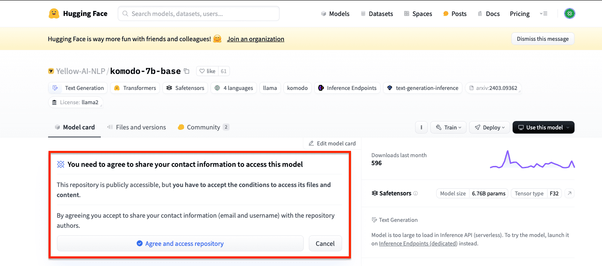

# Python : usage example 

&nbsp;

Please be sure to agree to the terms of access to this repository.

    

 

&nbsp;

---

## &#x1F530; Begin

Creating Directories and File Structures

<pre>
    ❯ vim requirements.txt

        huggingface-hub
        orch==2.2.1
        transformers==4.40.2
</pre>

&nbsp;

<pre>
    ❯ pwd
        /Users/.../&lt;project-name&gt;

    ❯ cd &lt;project-name&gt;

    ❯ python -m venv venv

    ❯ source ./venv/bin/activate

    ❯ pip install --no-cache-dir -r requirements.txt
</pre>

<pre>
    ❯ pip list

    Package            Version
    ------------------ ---------
    certifi            2024.2.2
    charset-normalizer 3.3.2
    filelock           3.14.0
    fsspec             2024.5.0
    huggingface-hub    0.23.1
    idna               3.7
    Jinja2             3.1.4
    MarkupSafe         2.1.5
    mpmath             1.3.0
    networkx           3.3
    numpy              1.26.4
    packaging          24.0
    pip                22.0.4
    PyYAML             6.0.1
    regex              2024.5.15
    requests           2.32.2
    safetensors        0.4.3
    setuptools         58.1.0
    sympy              1.12
    tokenizers         0.19.1
    torch              2.2.1
    tqdm               4.66.4
    transformers       4.40.2
    typing_extensions  4.12.0
    urllib3            2.2.1
</pre>